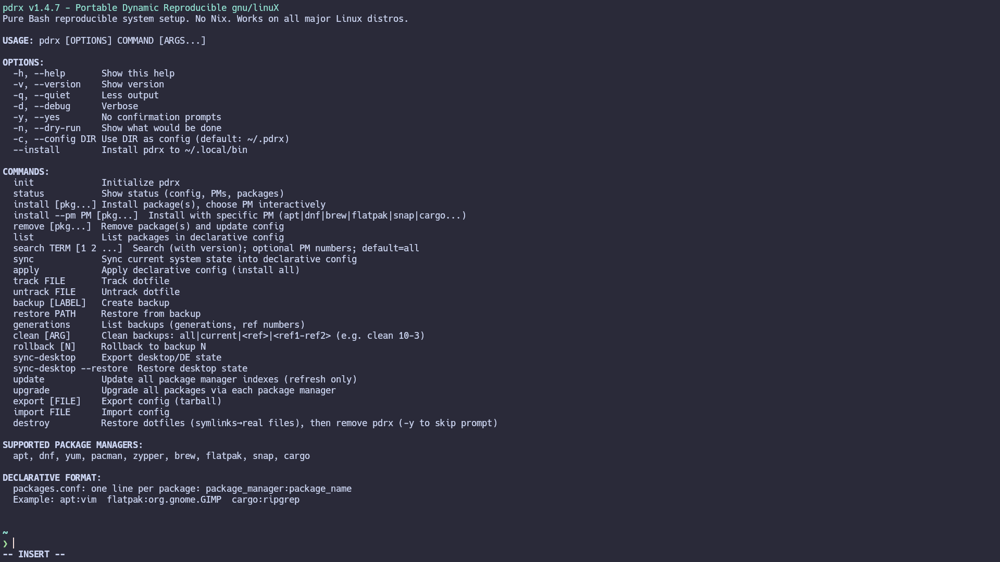

<div align="center">

<!-- Hero Section with Icon -->


<!-- Brand -->
<h1 align="center">
  <code>pdrx</code>
</h1>

<p align="center">
  <strong>Portable Dynamic Reproducible gnu/linuX</strong><br>
  <em>Imperative now. Declarative forever.</em>
</p>

<!-- Badges -->
<p align="center">
  <a href="https://github.com/stefan-hacks/pdrx/releases">
    
  </a>
  <a href="#">
    
  </a>
  <a href="#package-managers">
    
  </a>
  <a href="LICENSE">
    
  </a>
</p>

<!-- Quick Description -->
<p align="center">
  <strong>Capture your existing Linux setup. Reproduce it anywhere.<br>
  Zero dependencies. Pure Bash. Works on any distro.</strong>
</p>

<!-- Preview Image -->
<p align="center">
  
</p>

</div>

---

## 🎯 Why pdrx?

**Most dotfile managers** make you manually declare what you want.

**pdrx** discovers what's **already there** — your years of accumulated shell aliases, that carefully tuned neovim config, those GNOME extensions you forgot you installed.

```bash
# On your current machine — discover everything automatically
pdrx init
pdrx sync              # ← Captures ALL installed packages
pdrx sync-dotfiles     # ← Discovers .bashrc, .zshrc, .config/nvim, etc.
pdrx sync-desktop      # ← Exports GNOME/KDE/i3 settings

# Push to git
cd ~/.pdrx && git init && git add . && git commit -m "My setup" && git push

# On a fresh machine — restore everything
pdrx apply             # ← Reinstalls packages, deploys dotfiles, restores DE
```

---

## 🚀 Quick Start

### Install

```bash
curl -fsSL https://github.com/stefan-hacks/pdrx/releases/latest/download/pdrx -o ~/.local/bin/pdrx \
  && chmod +x ~/.local/bin/pdrx
```

### Capture Your System

```bash
pdrx init              # Initialize config directory (~/.pdrx)
pdrx sync              # Capture ALL installed packages
pdrx sync-dotfiles     # Auto-discover shell & editor configs
pdrx sync-desktop      # Export desktop environment settings
```

### Store & Restore

```bash
# Store in Git
cd ~/.pdrx
git init
git add config/ state/
git commit -m "Complete system setup"
git push -u origin main

# Restore on new machine
git clone https://github.com/YOUR_USERNAME/my-pdrx-config.git ~/.pdrx
pdrx init
pdrx apply --parallel  # Reinstall everything
```

---

## ✨ What Gets Captured

| Category | Command | What It Does |
|----------|---------|--------------|
| **📦 Packages** | `pdrx sync` | All user-installed packages from apt, dnf, pacman, flatpak, cargo, brew, snap |
| **🔧 Dotfiles** | `pdrx sync-dotfiles` | Auto-discovers .bashrc, .zshrc, .config/nvim, .config/kitty, etc. |
| **📁 Custom Files** | `pdrx track <path>` | Track any file or directory into version control |
| **🖥️ Desktop** | `pdrx sync-desktop` | GNOME, KDE, i3, Sway, Hyprland settings & extensions |
| **📋 Sources** | `pdrx source add` | PPAs, custom repos, flatpak remotes, GPG keys |
| **⚙️ Systemd** | `pdrx sync` | Enabled system and user units |

---

## 📦 Package Management

### Capture Everything

```bash
# The magic command — reads from apt-mark, dnf history, flatpak list, cargo --list, etc.
pdrx sync
```

### Install & Record

```bash
pdrx install vim git htop              # Install with auto-detection
pdrx install --pm flatpak org.gnome.GIMP  # Specific package manager
pdrx install --pm cargo ripgrep --pin  # Pin installed version
```

### Restore

```bash
pdrx apply              # Install all captured packages
pdrx apply --parallel   # Run different PMs concurrently (faster)
```

---

## 🔧 Dotfile Management

### Auto-Discover

```bash
pdrx sync-dotfiles
```

Finds and tracks configs for:
- **Shells:** Bash, Zsh, Fish, Nushell
- **Editors:** Vim, Neovim, Helix, Emacs, VS Code
- **Terminals:** Kitty, Alacritty, WezTerm
- **Tools:** Tmux, Git, SSH, Starship, Direnv, GPG

### Manual Tracking

```bash
pdrx track ~/.config/alacritty/alacritty.toml
pdrx track ~/.ssh/config
pdrx track ~/.config/systemd/user/
```

---

## 🖥️ Desktop Environments

```bash
# Export current settings
pdrx sync-desktop

# Restore on new machine
pdrx sync-desktop --restore
```

**Supported:** GNOME · KDE Plasma · XFCE · i3 · Sway · Hyprland

---

## 🔄 Repository Sources

Track third-party repos for full reproducibility:

```bash
# Add a PPA
pdrx source add apt ppa:deadsnakes/ppa

# Add Docker repo with GPG key
pdrx source add apt-repo \
  'deb [signed-by=/etc/apt/keyrings/docker.gpg] https://download.docker.com/linux/ubuntu jammy stable' \
  /etc/apt/keyrings/docker.gpg \
  https://download.docker.com/linux/ubuntu/gpg

# Add flatpak remote
pdrx source add flatpak flathub https://flathub.org/repo/flathub.flatpakrepo
```

---

## 🌐 Supported Package Managers

<p align="center">
  
  
  
  
  
  
  
  
</p>

| Manager | Discovery | Install |
|---------|-----------|---------|
| `apt` | `apt-mark showmanual` | `pdrx install --pm apt <pkg>` |
| `dnf` | `dnf history userinstalled` | `pdrx install --pm dnf <pkg>` |
| `pacman` | `pacman -Qe` | `pdrx install --pm pacman <pkg>` |
| `zypper` | `zypper search -i` | `pdrx install --pm zypper <pkg>` |
| `flatpak` | `flatpak list --app` | `pdrx install --pm flatpak <app>` |
| `cargo` | `cargo install --list` | `pdrx install --pm cargo <crate>` |
| `brew` | `brew leaves` | `pdrx install --pm brew <pkg>` |
| `snap` | `snap list` (excludes core*) | `pdrx install --pm snap <pkg>` |

---

## 📖 Command Reference

### Capture Commands

```bash
pdrx sync                   # Capture packages, sources, systemd
pdrx sync-dotfiles          # Auto-discover common dotfiles
pdrx sync-desktop           # Export DE settings
pdrx track <path>           # Track specific file/directory
```

### Restore Commands

```bash
pdrx apply                  # Full restore
pdrx apply --parallel       # Parallel restore (faster)
pdrx sync-desktop --restore # Restore DE only
```

### Package Commands

```bash
pdrx install <pkg>               # Install and record
pdrx install --pm <pm> <pkg>     # Use specific PM
pdrx install --pin               # Pin version
pdrx remove <pkg>                # Remove and un-record
pdrx list                        # List captured packages
pdrx search <term>               # Search across all PMs
```

### Maintenance

```bash
pdrx backup [label]         # Create checkpoint
pdrx rollback [N]           # Rollback to backup
pdrx status                 # Show system overview
pdrx history [N]            # Show audit log
pdrx self-update            # Update pdrx
```

---

## 🛡️ Version Pinning

```bash
# Pin current version
pdrx install --pm cargo ripgrep --pin

# Pin specific version
pdrx install --pm apt vim --pin=2:9.0.1672-1
```

---

## 🪝 Post-Apply Hooks

```bash
pdrx hook edit
```

Example `~/.pdrx/config/hooks/post-apply.sh`:
```bash
#!/bin/bash
sudo udevadm control --reload-rules
gnome-extensions enable user-theme@gnome-shell-extensions.gcampax.github.com
```

---

## 💾 Backups & Rollback

```bash
pdrx backup before-upgrade    # Create named backup
pdrx generations              # List all backups
pdrx rollback                 # Restore most recent
pdrx rollback 2               # Restore specific generation
```

---

## 🚫 Scope

**pdrx handles:**
- ✅ Packages from any package manager
- ✅ Repository/PPA sources with GPG keys
- ✅ Dotfiles and configuration files
- ✅ Desktop environment settings
- ✅ Enabled systemd units
- ✅ Post-apply hooks

**pdrx does NOT handle:**
- ❌ Disk partitioning, fstab, LUKS
- ❌ User/group creation
- ❌ Low-level system provisioning

---

## 📄 License

MIT License — see [LICENSE](LICENSE)

---

<div align="center">

**<code>pdrx</code>** — *Capture your setup once. Reproduce it forever.*

<p align="center">
  
  
</p>

</div>
