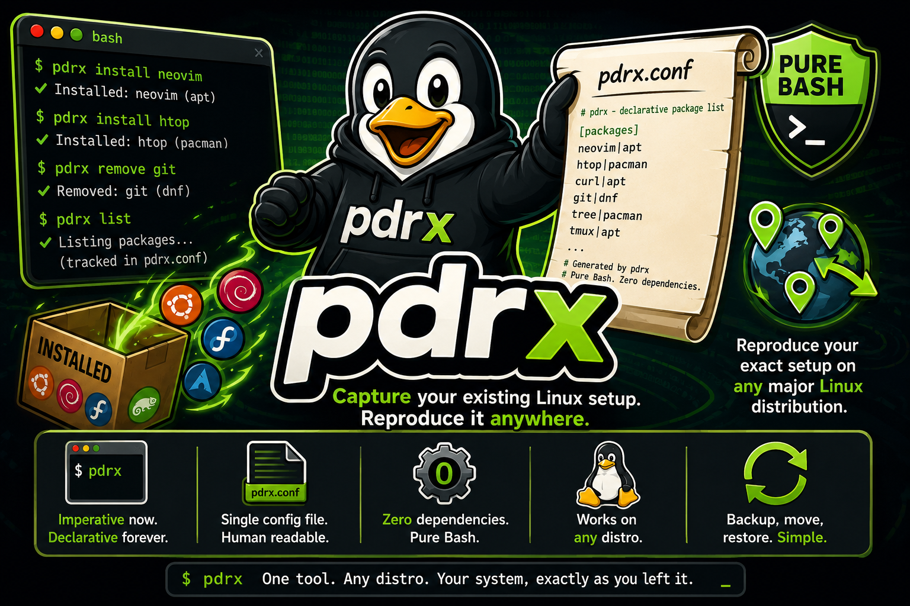

<p align="center">
  
</p>

# pdrx — Portable Dynamic Reproducible gnu/linuX

**Pure Bash tool for fully reproducible Linux system setups.** No Nix/stow/chez moi/ansible dependency.

Imperatively install/remove packages while automatically updating a **declarative config** that records both the package and **which package manager** installed it. Restore your exact setup on any major Linux distribution — or Windows via winget.

NOTE: This project originally started as scripts in my dotfiles, then stow which lead me to chez moi and then I combined their functionality but this proved problematic so then i created a wrapper to the nix package manager which caused me MANY issues and frustrations on GNOME so I decided to go nix free and just use BASH and have it support different distribution package managers. SO INSTEAD OF HAVING TO MANUALLY DECLARE EVERYTHING THIS STILL ENABLES ME TO DO NORMAL LINUX IMPERATIVE USE OF THE PACKAGE MANAGERS WHILE GENERATING DECLARITIVE FILES RESPECTIVELY. I also finally decided to get cursor AI (NO AI WAS HARMED IN THE MAKING OF THIS PROJECT but it really helped - no shade) and shellcheck to help me clean up and improve/enhance my bash scripts, ideas and documentation. Enjoy!! Please let me know if you encounter any issues.

## Features

- **All major Linux distros** — Debian, Ubuntu, Fedora, Arch, openSUSE, etc.
- **Multiple package managers** — apt, dnf, yum, pacman, zypper, Homebrew, Flatpak, Snap, Cargo, **winget**
- **Reproducible** — Declarative config records `package_manager:package_name` (or `package_manager:package_name=version` when pinned) for exact replay
- **Imperative + declarative** — `pdrx install vim` updates your declarative config automatically
- **Optional version pinning** — `--pin` records the exact installed version; unpinned is still the default
- **Parallel operations** — `--parallel` flag on `apply` and `search` for faster multi-package workflows
- **Desktop export/restore** — GNOME, KDE, XFCE, i3, Sway, Hyprland
- **Dotfile tracking** — Track `~/.bashrc`, `~/.config/nvim/init.vim`, etc.
- **Backups & rollback** — Timestamped backups; rollback to any generation
- **Export/Import** — Share config across machines

## Installation

### One-line install (curl or wget)

Install to `~/.local/bin` and make executable in a single command:

```bash
# With curl:
mkdir -p ~/.local/bin && curl -sSL https://raw.githubusercontent.com/stefan-hacks/pdrx/main/pdrx -o ~/.local/bin/pdrx && chmod +x ~/.local/bin/pdrx
```

```bash
# With wget:
mkdir -p ~/.local/bin && wget -qO ~/.local/bin/pdrx https://raw.githubusercontent.com/stefan-hacks/pdrx/main/pdrx && chmod +x ~/.local/bin/pdrx
```

Ensure `~/.local/bin` is in your PATH (add to `~/.bashrc` or `~/.zshrc` if needed):

```bash
export PATH="$HOME/.local/bin:$PATH"
```

Then run `pdrx init` to initialize.

### Homebrew (macOS / Linux)

If you use [Homebrew](https://brew.sh/), you can install **pdrx** and the **man page** in one step:

```bash
brew tap stefan-hacks/pdrx https://github.com/stefan-hacks/pdrx
brew install pdrx
```

This installs the `pdrx` binary and the man page (so `man pdrx` works). Then run `pdrx init` to initialize your config.

To upgrade to the latest release:

```bash
brew upgrade pdrx
```

### Clone and install

```bash
git clone https://github.com/stefan-hacks/pdrx.git
cd pdrx
chmod +x pdrx
./pdrx --install
source ~/.bashrc
pdrx init
```

Or with Make:

```bash
make install
pdrx init
```

### Man page (optional)

To install the man page so you can run **man pdrx** for detailed, offline documentation:

```bash
./install_manpage.sh --user    # Install to ~/.local/share/man (no root)
# Or for system-wide:
sudo ./install_manpage.sh --system
```

If **man pdrx** does not find the page after a user install, add to your `~/.bashrc` or `~/.zshrc`:

```bash
export MANPATH="$HOME/.local/share/man:$MANPATH"
```

## Quick Start

```bash
pdrx init
pdrx sync                          # Capture current packages into declarative config
pdrx install vim git               # Install and choose PM interactively
pdrx install --pm flatpak org.gnome.GIMP   # Install with specific PM
pdrx install --pm cargo rg --pin   # Install and pin the installed version
pdrx track ~/.bashrc
pdrx backup
pdrx status
```

## Declarative Format and Package Manager Recording

`~/.pdrx/config/packages.conf` records **which package manager** installed each package. This ensures **reproducible restore** — the same PM is used when applying on a new system.

```
# pdrx declarative packages
# Format: package_manager:package_name  or  package_manager:package_name=version (pinned)
#
# ADD:     pdrx install <pkg> records PM used. pdrx install --pm <pm> <pkg> forces a PM.
# ADD PIN: pdrx install --pin <pkg> records PM and version. --pin=VERSION pins a specific version.
# REMOVE:  pdrx remove <pkg> uses the recorded PM, removes from config.
# RESTORE: pdrx apply uses the recorded PM for each package. Same PM = reproducible.
#
# Synced: 2025-02-14T12:00:00+0000
# OS: debian

apt:vim
apt:git
apt:htop
apt:vim=2:9.0.1672-1ubuntu3
flatpak:org.gnome.GIMP
cargo:ripgrep
cargo:ripgrep=14.1.0
brew:jq
winget:Vim.Vim
```

### How Add / Remove / Restore Works

| Action | Behavior |
|--------|----------|
| **Add** | `pdrx install vim` — choose PM interactively; recorded as `apt:vim`. `pdrx install --pm flatpak org.gnome.GIMP` forces Flatpak. |
| **Add (pinned)** | `pdrx install --pm apt vim --pin` — installs and records the current version as `apt:vim=2:9.0.1672-1`. Use `--pin=9.0` to specify the version explicitly. |
| **Remove** | `pdrx remove vim` — looks up the recorded PM, uninstalls, removes the line from config. Add `-n` to preview without making changes. |
| **Restore** | `pdrx apply` — reads each `pm:package[=version]` line and installs via that PM. `--parallel` runs different PMs concurrently. |

**Why this matters:** A package like `ripgrep` might be available from apt, brew, or cargo. Recording `cargo:ripgrep` ensures `pdrx apply` installs it with `cargo install ripgrep`, not apt or brew.

**Version pinning is opt-in.** Packages are unpinned by default. Only use `--pin` when you need to lock a specific version for reproducibility.

## Options and Commands

### Global options (before command)

| Option | Description |
|--------|--------------|
| `-h`, `--help` | Show help and exit |
| `-v`, `--version` | Show version |
| `-q`, `--quiet` | Less output |
| `-d`, `--debug` | Verbose output |
| `-y`, `--yes` | Skip confirmation prompts |
| `-n`, `--dry-run` | Show what would be done, no changes |
| `-c`, `--config DIR` | Use `DIR` as pdrx home (default: `~/.pdrx`) |
| `--install` | Install pdrx to `~/.local/bin` and add to PATH |

**Examples:**
```bash
pdrx -h                         # Show help
pdrx -v                         # Show version
pdrx -y destroy                 # Uninstall without confirmation prompt
pdrx -n apply                   # Dry-run: show what would be installed
pdrx -n remove vim              # Dry-run: preview what remove would do
pdrx -c /opt/my-pdrx status     # Use alternate config directory
```

### Commands with examples

| Command | Description | Examples |
|---------|-------------|----------|
| `init` | Initialize pdrx | `pdrx init` |
| `status` | Show config, PMs, packages, backups | `pdrx status` |
| `install [pkg...]` | Install and choose PM interactively | `pdrx install vim git htop` |
| `install --pm PM [pkg...]` | Install with specific PM | `pdrx install --pm flatpak org.gnome.GIMP`<br>`pdrx install --pm cargo ripgrep bat` |
| `install --pin [pkg...]` | Install and record the installed version | `pdrx install --pm cargo rg --pin`<br>`pdrx install --pm apt vim --pin=9.0` |
| `remove [pkg...]` | Remove packages (uses recorded PM) | `pdrx remove vim`<br>`pdrx -n remove vim` (dry-run) |
| `list` | List packages in declarative config | `pdrx list` |
| `search [--parallel] TERM [num ...]` | Search with version; optional PM numbers; `--parallel` for speed | `pdrx search ripgrep`<br>`pdrx search vim 1 4`<br>`pdrx search --parallel ripgrep` |
| `sync` | Capture current system into declarative config | `pdrx sync` |
| `apply [--parallel]` | Install all from declarative config | `pdrx apply`<br>`pdrx apply --parallel` |
| `track FILE` | Track dotfile | `pdrx track ~/.bashrc` |
| `untrack FILE` | Untrack dotfile | `pdrx untrack ~/.bashrc` |
| `backup [LABEL]` | Create timestamped backup | `pdrx backup before-migration` |
| `restore PATH` | Restore from backup | `pdrx restore ~/.pdrx/backups/20250214_120000_manual` |
| `generations` | List backups (ref numbers, oldest to newest) | `pdrx generations` |
| `clean [ARG]` | Clean backups: `all`, `current`, single ref, or range | `pdrx clean`<br>`pdrx clean all`<br>`pdrx clean 2-4` |
| `rollback [N]` | Rollback to backup N | `pdrx rollback` or `pdrx rollback 2` |
| `sync-desktop` | Export desktop/DE state | `pdrx sync-desktop` |
| `sync-desktop --restore` | Restore desktop state | `pdrx sync-desktop --restore` |
| `update` | Update all PM indexes (refresh only, no upgrade) | `pdrx update` |
| `upgrade` | Upgrade all packages via each PM | `pdrx upgrade` |
| `export [FILE]` | Export config tarball | `pdrx export my-config.tar.gz` |
| `import FILE` | Import config | `pdrx import my-config.tar.gz` |
| `destroy` | Restore tracked dotfiles (symlinks → real files), then remove pdrx | `pdrx destroy` or `pdrx -y destroy` |

## Supported Package Managers

| PM | Distros / Platform | Notes |
|----|-------------------|-------|
| apt | Debian, Ubuntu | System packages |
| dnf | Fedora, RHEL 8+ | System packages |
| yum | RHEL 7, CentOS | System packages |
| pacman | Arch, Manjaro | System packages |
| zypper | openSUSE | System packages |
| brew | Any (Homebrew) | User packages; no sudo required |
| flatpak | Any | User/system apps |
| snap | Ubuntu, others | Snaps |
| cargo | Any (Rust) | `cargo install` crates; `upgrade` auto-installs cargo-update if needed |
| winget | Windows | Windows Package Manager; use full package IDs (e.g. `Vim.Vim`) |

## Version Pinning

Version pinning is **opt-in** and not the default. Use `--pin` only when you need reproducibility at a specific version.

```bash
# Install without pinning (default — always installs latest on apply)
pdrx install --pm apt vim

# Install and auto-pin the version that was actually installed
pdrx install --pm apt vim --pin

# Install a specific version and pin it
pdrx install --pm apt vim --pin=2:9.0.1672-1

# Result in packages.conf:
# apt:vim=2:9.0.1672-1
```

Version syntax per PM when applying a pinned package:

| PM | Pinned install syntax |
|----|----------------------|
| apt | `apt-get install pkg=version` |
| dnf / yum | `dnf install pkg-version` |
| zypper | `zypper install pkg=version` |
| cargo | `cargo install pkg --version version` |
| brew | `brew install pkg@version` (formula must exist) |
| winget | `winget install --id pkg --version version` |
| snap | Uses version as channel |
| pacman / flatpak | CLI pinning not supported; installs latest and warns |

## Parallel Operations

### `apply --parallel`

Groups packages by PM (so apt/dnf each run only one instance, respecting their lock), then runs each PM group as a background job. Different PMs install concurrently.

```bash
pdrx apply --parallel
```

### `search --parallel`

Searches all selected PMs simultaneously. Output is buffered per PM and printed in the original order so results stay readable.

```bash
pdrx search ripgrep --parallel
pdrx search vim 1 3 --parallel   # search only PM 1 and 3, in parallel
```

## Cargo Upgrades

`pdrx upgrade` handles cargo crate upgrades automatically:

- If `cargo-update` is already installed, runs `cargo install-update -a`
- If not, prompts you to install it on the spot
- You can always install it manually: `cargo install cargo-update`

```bash
pdrx upgrade   # upgrades all PMs; prompts for cargo-update if needed
```

## Reproducible Workflow

1. **On source machine:**
   ```bash
   pdrx init
   pdrx sync              # Capture all installed packages + PM
   pdrx track ~/.bashrc ~/.vimrc
   pdrx sync-desktop      # Export GNOME/KDE/... settings
   pdrx backup
   pdrx export > my-config.tar.gz
   ```

2. **On new machine:**
   ```bash
   pdrx init
   pdrx import my-config.tar.gz
   pdrx apply --parallel  # Install all packages via correct PMs (faster)
   pdrx sync-desktop --restore
   ```

## Configuration Layout

```
~/.pdrx/
├── config/
│   ├── packages.conf     # Declarative: pm:package or pm:package=version
│   ├── dotfiles/         # Tracked dotfiles
│   └── desktop-export/   # Exported DE state
├── backups/              # Timestamped backups
│   └── 20250214_120000_manual/
│       ├── packages.conf
│       ├── desktop-export/
│       ├── dotfiles/
│       └── tracked-dotfiles
└── state/
    ├── initialized
    ├── version
    └── tracked-dotfiles
```

Each backup includes `packages.conf` with full `pm:package[=version]` records. `pdrx restore` copies that back; then `pdrx apply` installs using the recorded PMs.

## Version control: push .pdrx to GitHub

You can put `~/.pdrx` under version control and push it to GitHub for backup and sync across machines.

### 1. Initialize git in your pdrx directory

```bash
cd ~/.pdrx
git init
```

### 2. Add a .gitignore (optional but recommended)

Exclude backups (they can be large) and keep only config + state:

```bash
cat > ~/.pdrx/.gitignore << 'EOF'
# Exclude backups (optional - they can be large)
backups/

# Or include everything and exclude only huge dirs
# backups/*/
EOF
```

Or track everything including backups if you want full history.

### 3. Create the repository on GitHub

1. Go to [github.com/new](https://github.com/new)
2. Create a new repo (e.g. `my-pdrx-config`)
3. Do **not** initialize with README (you already have content locally)

### 4. Add remote and push

```bash
cd ~/.pdrx
git add config/ state/
# Or: git add .   (if you want to include backups and .gitignore)
git commit -m "Initial pdrx config"
git branch -M main
git remote add origin https://github.com/YOUR_USERNAME/my-pdrx-config.git
git push -u origin main
```

### 5. Clone on another machine

```bash
git clone https://github.com/YOUR_USERNAME/my-pdrx-config.git ~/.pdrx
cd ~/.pdrx
pdrx init   # if not yet initialized
pdrx apply
pdrx sync-desktop --restore
```

### 6. Daily workflow

```bash
cd ~/.pdrx
pdrx sync              # after installing/removing packages
pdrx sync-desktop      # after changing DE settings
git add .
git commit -m "Update config"
git push
```

### 7. One repo for multiple users or machines

You can keep **several pdrx configs** (e.g. different users or machines) in **one GitHub repo** by using one directory per "profile". Each directory is a full pdrx home (its own `config/` and `state/`). Use **`-c DIR`** or **`PDRX_HOME`** so pdrx uses the right one.

**1. Create a repo and clone it once (e.g. for all your configs):**

```bash
git clone https://github.com/YOUR_USERNAME/my-pdrx-configs.git ~/pdrx-configs
cd ~/pdrx-configs
```

**2. Add one directory per user or machine (each will be a pdrx "home"):**

Examples: `alice`, `bob`, `laptop`, `desktop`, `work`, etc.

```bash
mkdir -p alice/config alice/state
mkdir -p laptop/config laptop/state
# Repeat for each profile
```

**3. Add a root `.gitignore`** (so backups stay local and optional):

```bash
# In ~/pdrx-configs/.gitignore
backups/
*.tar.gz
```

**4. Use a profile by pointing pdrx at its directory:**

```bash
# Use "alice" config for this session
export PDRX_HOME=~/pdrx-configs/alice
pdrx init          # first time only
pdrx apply
pdrx sync-desktop --restore
```

Or without exporting (every command):

```bash
pdrx -c ~/pdrx-configs/alice init
pdrx -c ~/pdrx-configs/alice apply
pdrx -c ~/pdrx-configs/laptop status   # different profile
```

**5. Optional: small wrapper scripts or shell aliases** so you don't type `-c` each time:

```bash
# In ~/.bashrc or ~/.zshrc
alias pdrx-alice='pdrx -c ~/pdrx-configs/alice'
alias pdrx-laptop='pdrx -c ~/pdrx-configs/laptop'

# Then:
pdrx-alice sync
pdrx-laptop apply
```

**6. Workflow per profile:** from the repo root, add/commit only the profile you changed:

```bash
cd ~/pdrx-configs
git add alice/config alice/state
git commit -m "Update alice config"
git push
```

On another machine (or as another user), clone the same repo and use the same profile name:

```bash
git clone https://github.com/YOUR_USERNAME/my-pdrx-configs.git ~/pdrx-configs
pdrx -c ~/pdrx-configs/laptop init
pdrx -c ~/pdrx-configs/laptop apply
```

**Summary:** One repo → many directories (one per user/machine). Always pass that directory with **`-c ~/pdrx-configs/PROFILE`** or set **`PDRX_HOME=~/pdrx-configs/PROFILE`** so pdrx uses the right config.

---

## Workflow: desktop user

Typical flow for a **desktop user** (GNOME/KDE, apps, personal machine):

### Initial setup (one-time)

```bash
pdrx init
pdrx sync                    # Capture existing packages
pdrx sync-desktop            # Export GNOME/KDE settings
pdrx track ~/.bashrc ~/.config/gtk-4.0/settings.ini   # Optional: track key configs
pdrx backup initial
```

### Installing new apps

```bash
# System packages (browser, utilities)
pdrx install firefox-esr htop

# Flatpak apps (isolated, newer versions)
pdrx install --pm flatpak org.gnome.GIMP org.telegram.desktop

# Snap apps (if you use them)
pdrx install --pm snap code
```

### Before/after big changes

```bash
pdrx backup before-upgrade
# ... do system upgrade or migration ...
pdrx sync
pdrx backup after-upgrade
```

### Moving to a new machine

1. Push your config: `cd ~/.pdrx && git push` (or `pdrx export > config.tar.gz` and copy it)
2. On the new machine: clone or import, then run `pdrx apply --parallel` and `pdrx sync-desktop --restore`

---

## Workflow: developer

Typical flow for a **developer** (dev tools, dotfiles, multiple machines):

### Initial setup

```bash
pdrx init
pdrx install --pm apt build-essential git curl         # Base dev stack
pdrx install --pm cargo ripgrep fd-find bat --pin      # Rust CLI tools, pinned
pdrx install --pm flatpak org.gnome.Builder            # Or your preferred IDE
pdrx track ~/.bashrc ~/.vimrc ~/.config/nvim/init.vim ~/.tmux.conf
pdrx sync-desktop
pdrx backup dev-setup
```

### Project-specific tools (e.g. Rust, Node, Python)

```bash
# Cargo crates (global dev tools)
pdrx install --pm cargo rustfmt clippy

# Optional: Homebrew for tools not in apt
pdrx install --pm brew jq yq-go
```

### Sync config across workstation and laptop

```bash
# On workstation (after changes)
cd ~/.pdrx
pdrx sync
git add .
git commit -m "Add new tools"
git push

# On laptop
cd ~/.pdrx
git pull
pdrx apply --parallel
pdrx sync-desktop --restore
```

### New machine (fresh install) INSTALL YOUR PACKAGE MANAGERS FIRST - I have a script for mine.

```bash
git clone https://github.com/YOUR_USER/my-pdrx-config.git ~/.pdrx
cd ~/.pdrx
pdrx init
pdrx apply --parallel
pdrx sync-desktop --restore
# Your dotfiles are deployed, packages installed via the same PMs
```

### Rollback after a bad change

```bash
pdrx generations
pdrx rollback 2    # Restore from 2nd-most-recent backup
```

---

## License

MIT
